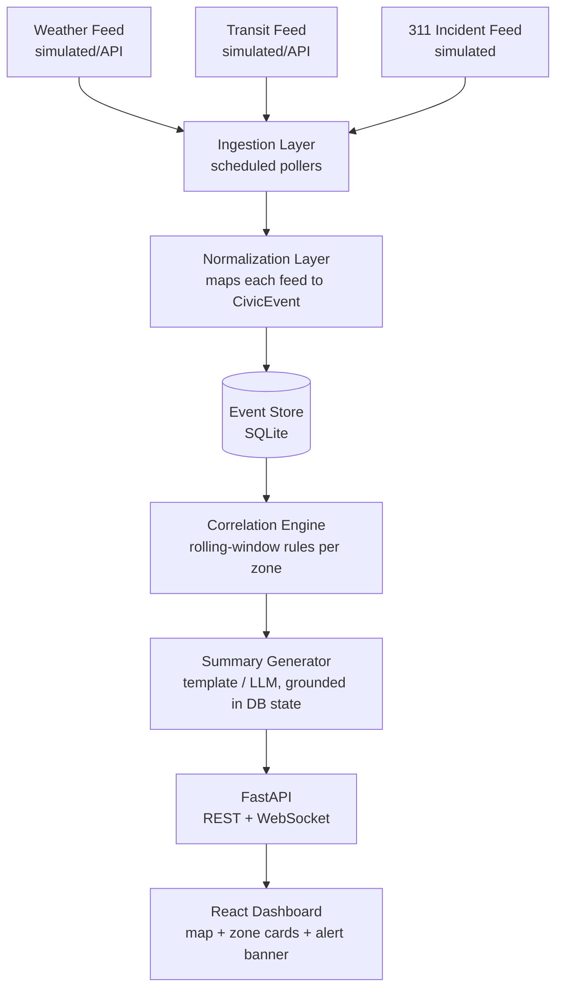

# CityPulse — Architecture

## 1. System Diagram

## 2. Data Model

### `CivicEvent` (common normalized schema — every feed maps to this)

| Field | Type | Notes |
|---|---|---|
| `id` | string (UUID) | Unique per event |
| `zone` | string | `zone-1` … `zone-n`, the spatial unit CityPulse reasons over |
| `timestamp` | ISO 8601 datetime | Normalized to UTC regardless of source format |
| `source` | enum | `weather` \| `transit` \| `311` (extensible) |
| `type` | string | e.g. `flood_alert`, `delay`, `power_outage`, `noise_complaint` |
| `severity` | enum | `low` \| `medium` \| `high` |
| `payload` | object | Source-specific raw fields, preserved for detail view / audit |

### `ZoneStatus` (derived, not stored — computed per request/window)

| Field | Type | Notes |
|---|---|---|
| `zone` | string | |
| `status` | enum | `calm` \| `elevated` \| `alert` |
| `active_event_count` | int | Events in the current rolling window |
| `correlations` | list of `CorrelationFlag` | Zero or more detected possible-links |
| `summary` | string | Plain-language, grounded, generated line |
| `feed_health` | object | Per-source: `ok` \| `delayed` \| `missing`, last-seen timestamp |

### `CorrelationFlag`

| Field | Type | Notes |
|---|---|---|
| `sources_involved` | list | e.g. `["weather", "311"]` |
| `rule_id` | string | Which rule fired (for explainability) |
| `confidence` | enum | `possible_link` only in MVP — never `confirmed` |
| `window_minutes` | int | The rolling window the rule evaluated |

## 3. Component Breakdown

### Ingestion Layer
- One adapter per feed (`weather_adapter.py`, `transit_adapter.py`, `incidents_adapter.py`).
- Each adapter runs on its own schedule (APScheduler), matching that feed's natural cadence — weather hourly-ish, transit every few minutes, 311 event-driven.
- Adapters can point at a real public API or the bundled simulator — same output contract either way, so swapping a data source later doesn't touch downstream code.

### Normalization Layer
- Pure functions: `raw_feed_record -> CivicEvent`.
- Responsible for timezone alignment, zone-mapping (lat/lon or address → zone ID), and severity mapping (each feed's own scale → the shared `low/medium/high`).

### Event Store
- SQLite table `events`, indexed on `(zone, timestamp)` for fast rolling-window queries.
- Upgrade path: swap to Postgres with the same schema when moving past hackathon scale.

### Correlation Engine
- Runs over a rolling window (default: last 30 minutes) per zone.
- MVP rule set is explicit and inspectable — e.g.:
  - Rule `weather_x_incidents`: active `high`/`medium` weather alert in zone AND 311 complaint count in zone above a threshold within the window ⇒ flag.
  - Rule `transit_x_incidents`: active transit delay AND a power/traffic-related 311 complaint in the same zone within the window ⇒ flag.
- Each rule is a small, named, testable function — easy to demo "here's exactly why this fired."
- **Never outputs causation language** — only ever "possible link" plus the rule that fired, so the summary generator has something honest to describe.

### Summary Generator
- Input: the current `ZoneStatus` object (events + correlation flags) for one zone — nothing else.
- Template mode: fills a sentence template based on which rule(s) fired.
- LLM-assisted mode: sends only the structured `ZoneStatus` JSON to the model with a system prompt that forbids inventing facts not present in the payload and requires "possible link" phrasing for any correlation — the model is a phrasing layer, not a source of claims.

### API Layer (FastAPI)
- `GET /zones` — all zones' current `ZoneStatus`.
- `GET /zones/{id}` — one zone's detail (events + correlations + summary).
- `GET /zones/{id}/events?window=30m` — raw recent events for the detail panel.
- `WS /ws/zones` — pushes updated `ZoneStatus` objects as new events land or the rolling window recomputes.

### Frontend (React)
- **ZoneMap** — grid or Leaflet map, zones colored by status.
- **ZoneCard** — summary line + status badge + feed-health indicator.
- **ZoneDetailPanel** — recent raw events, correlation flags with "possible link" framing, source attribution.
- **AlertBanner** — optional, shows when any zone crosses the alert threshold.
- **ReplayControls** (nice-to-have) — scrub a timestamp to replay historical `ZoneStatus` states.

## 4. Failure Modes & Degradation

| Scenario | Behavior |
|---|---|
| One feed stops sending events | `feed_health` for that source flips to `delayed`/`missing`; zone status still computes from remaining feeds; UI shows a small "transit data delayed" note instead of breaking |
| No correlation rule fires | Zone shows `calm`/`elevated` with a summary like "No unusual activity detected in the last 30 minutes" — never a forced/fake correlation |
| LLM summary call fails | Falls back to the template-based summary automatically |

## 5. Extensibility Notes (post-hackathon)

- New feed = new adapter + normalization mapping. Correlation engine and everything downstream is feed-agnostic as long as it emits `CivicEvent`.
- Rule-based correlation engine can be swapped for/augmented with a statistical model (e.g., rolling z-score on event volume per zone) without changing the API contract — `ZoneStatus` shape stays the same.
- Multi-city support is a `city_id` addition to `zone` scoping, not a schema redesign.
