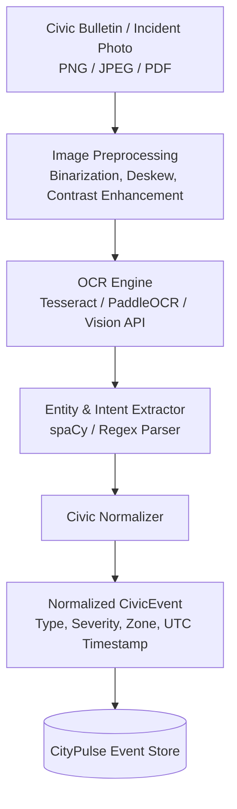

# OCR & Multimodal Ingestion Architecture
## CityPulse: Optical Character Recognition for Civic Bulletins & Incident Images

---

## 1. Overview & Purpose
In real-world municipal environments, critical civic alerts and citizen incident reports do not arrive solely as clean, structured JSON payloads. Many critical notifications exist as:
1. **Scanned PDF emergency declarations** issued by municipal or county agencies.
2. **Citizen-submitted photos of paper road closure notices, physical transit outage boards, or utility notices**.
3. **Public social media bulletin screenshots** broadcast during natural disasters.

The **OCR & Multimodal Ingestion Pipeline** provides CityPulse with the capability to ingest, parse, and normalize textual data extracted from visual civic media into the standardized `CivicEvent` schema.

---

## 2. OCR Architecture Pipeline



---

## 3. Subsystem Breakdown

### 3.1 Preprocessing Module (`backend/app/adapters/ocr_preprocessor.py`)
Raw images from mobile cameras or scanned notices suffer from noise, uneven lighting, and perspective distortion. Preprocessing steps include:
- **Grayscale Conversion & Gaussian Blur:** Noise reduction.
- **Otsu's Thresholding / Adaptive Binarization:** Maximizing text-to-background contrast.
- **Deskewing (Hough Transform):** Correcting camera tilt.

### 3.2 Optical Character Recognition Engine
- **Engine Selection:** Lightweight Tesseract OCR (`pytesseract`) for on-premise zero-cost local execution, with optional cloud fallback to Google Cloud Vision API for low-resolution or multi-language signage.
- **Target Extraction Entities:**
  - **Location Identifiers:** Street names, intersections, landmark names (mapped to zone coordinates).
  - **Timestamp / Duration:** Dates, validity windows (e.g., *"Valid until 18:00 UTC"*).
  - **Disruption Category:** Flooding, power hazard, road closure, rail cancellation.

### 3.3 Civic Entity Mapping & Normalization
Extracted raw text strings are matched against the CityPulse taxonomy:
```python
# Sample mapping heuristic
if "flood" in ocr_text.lower() or "water level" in ocr_text.lower():
    event_type = "flood_alert"
    severity = SeverityEnum.HIGH
elif "delay" in ocr_text.lower() or "suspended" in ocr_text.lower():
    event_type = "service_suspended"
    severity = SeverityEnum.HIGH
```

---

## 4. Performance & Reliability Safeguards
- **Confidence Scoring:** Every OCR extraction assigns an OCR confidence score ($0.0 - 1.0$). Text segments with confidence $< 0.70$ are flagged for human-in-the-loop review and excluded from auto-triggering high-alert thresholds.
- **Asynchronous Processing:** OCR workloads run in dedicated async worker threads to prevent blocking the FastAPI ASGI event loop.
- **PII Scrubbing:** OCR outputs are passed through the standard PII scrubbing filter before insertion into the `events` table.
