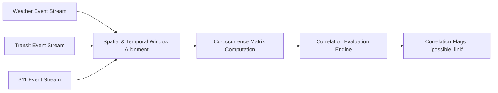

# Machine Learning & AI Architecture
## CityPulse: Anomaly Detection, Time-Series Correlation, and Grounded NLP

---

## 1. Machine Learning Strategy
CityPulse employs a **dual-tier intelligence architecture**:
1. **Tier 1 (Deterministic Rules & Statistical Z-Scores):** Fast, explainable, zero-latency correlation engine suitable for 24/7 real-time edge or server deployment.
2. **Tier 2 (Grounded Natural Language Synthesis & Agentic Monitoring):** LLM-assisted plain-language narrative generation with strict grounding constraints to guarantee zero factual hallucinations.

---

## 2. Statistical Anomaly Detection Engine

Rather than relying purely on static threshold numbers (e.g. "more than 3 complaints"), CityPulse implements a **Rolling Z-Score Anomaly Detector** over event velocity per zone:

$$Z(t) = \frac{X(t) - \mu_w}{\sigma_w}$$

Where:
- $X(t)$ is the volume of events in zone $z$ in the current 10-minute slice.
- $\mu_w$ is the rolling mean of event volume in zone $z$ over the historical baseline window $w$ (e.g. past 7 days or past 24 hours).
- $\sigma_w$ is the rolling standard deviation.

### Anomaly Decision Boundaries:
- $|Z| < 1.5$: **Calm / Normal Variance**
- $1.5 \le |Z| < 2.5$: **Elevated Variance** (pre-alert threshold)
- $|Z| \ge 2.5$: **Statistical Anomaly / Alert** (unusual spike requiring cross-feed correlation evaluation)

---

## 3. Cross-Feed Time-Series Correlation Engine

The correlation engine identifies temporal and spatial intersection between independent data feeds.



### Deterministic Correlation Rules:
1. **Rule `weather_x_incidents`:**
   - Precondition: Weather severity $\ge \text{Medium}$ within $T \in [t - 30\text{m}, t]$ in Zone $Z$.
   - Trigger: Count of 311 events in Zone $Z$ exceeds baseline by $\ge 200\%$.
   - Output: `CorrelationFlag(rule_id="weather_x_incidents", confidence="possible_link")`.
2. **Rule `weather_x_transit`:**
   - Precondition: Active flash flood, severe ice, or storm advisory in Zone $Z$.
   - Trigger: Transit delay $> 10$ minutes or line suspension in Zone $Z$.
   - Output: `CorrelationFlag(rule_id="weather_x_transit", confidence="possible_link")`.
3. **Rule `transit_x_incidents`:**
   - Precondition: Transit line halt or severe delay.
   - Trigger: Co-occurring 311 complaints categorized as `transit`, `traffic_signal`, or `power_outage`.
   - Output: `CorrelationFlag(rule_id="transit_x_incidents", confidence="possible_link")`.

---

## 4. Grounded NLP Narrative Generator

### 4.1 Grounding Guardrail Architecture
A common failure of generative AI in civic applications is inventing reasons for events (e.g., claiming a flood was caused by a broken dam when no such data exists).

CityPulse enforces strict **Data Grounding**:
- The prompt provided to the language model contains *only* verified database attributes from the current `ZoneStatus`.
- The system prompt strictly prohibits speculation and requires framing correlations as "possible links".

### 4.2 System Prompt Specification
```markdown
You are the CityPulse Civic Narrative Generator.
Your role is to translate structured civic event telemetry into exactly ONE concise, plain-language sentence for urban residents.

CRITICAL INSTRUCTIONS:
1. You may ONLY state facts present in the provided JSON payload.
2. NEVER invent, assume, or extrapolate causes not explicitly stated.
3. Every correlation MUST be described as a "possible link" or "co-occurring with", NEVER a confirmed cause.
4. Keep the sentence under 25 words. Understandable by an 8th grader.
5. If the zone is calm, simply state that conditions are calm.
```

### 4.3 Fallback Engine
If the LLM endpoint is unreachable, experiences latency $> 400\text{ms}$, or returns invalid JSON, the system instantaneously falls back to deterministic template string interpolation in `backend/app/services/summary_generator.py`.
