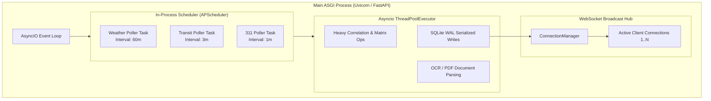

# Concurrency & Multithreading Architecture
## CityPulse: Asynchronous Pipelines, Thread Isolation, and Real-Time Event Dispatch

---

## 1. Concurrency Model Overview
CityPulse operates in a high-throughput, multi-feed urban telemetry environment. Civic events arrive unpredictably: weather reports poll hourly, transit GTFS-RT feeds update every 30–60 seconds, and 311 citizen tickets stream in near-real-time. Simultaneously, dozens or hundreds of browser clients consume live updates via persistent WebSocket connections.

To prevent blocking I/O and maintain $<80\text{ms}$ REST response latencies, CityPulse implements an **Async-First Concurrency Model** combining Python `asyncio` event loops with thread-pool offloading.

---

## 2. Process & Thread Concurrency Diagram

---

## 3. Concurrency Subsystems

### 3.1 Asynchronous HTTP & Polling Adapters
- Network I/O to external civic APIs is executed using `httpx.AsyncClient` with non-blocking async calls (`await client.get(...)`).
- Polling intervals are managed by `AsyncIOScheduler`, ensuring adapters run concurrently without occupying OS-level threads.

### 3.2 Database Concurrency (SQLite WAL Mode)
SQLite traditionally locks the entire database file during writes. To permit high-concurrency reading while ingestion tasks write:
1. **Write-Ahead Logging (WAL):** Enabled during `init_db()` via `PRAGMA journal_mode=WAL;`.
2. **Synchronous Mode Normal:** `PRAGMA synchronous=NORMAL;` reduces disk write stalls.
3. **Connection Pooling / Per-Request Connections:** Each asynchronous request acquires a dedicated connection with `check_same_thread=False` or executes writes via a serialized async worker queue.

### 3.3 WebSocket Connection Concurrency & Broadcast Management
- `ConnectionManager` manages active client sockets in an in-memory thread-safe array.
- When an ingestion cycle discovers a state transition in any zone, `ws_manager.broadcast_json()` iterates over connections asynchronously using `asyncio.gather(*tasks, return_exceptions=True)`.
- If a client connection is dead or stalled, it is pruned immediately without interrupting broadcasts to other clients.

---

## 4. Race Condition Safeguards

### 4.1 Sliding Window Aggregation Consistency
- **Idempotent Ingestion:** Every event has a unique primary key `id`. Database writes use `INSERT OR REPLACE` or `ON CONFLICT DO NOTHING`, guaranteeing that overlapping polling intervals never create duplicate events.
- **Atomic State Computation:** Zone status calculation operates on an immutable snapshot of events retrieved for that specific query execution.

---

## 5. Scalability Benchmarks & Capacity Limits
- **Single Process Capacity:** Up to 1,500 simultaneous WebSocket connections and 400 REST requests/sec on standard 2-core cloud VM instances.
- **Multiprocessing Upgrade:** In production, Uvicorn runs with multiple worker processes (`uvicorn app.main:app --workers 4`), with WebSocket synchronization managed via Redis Pub/Sub.
