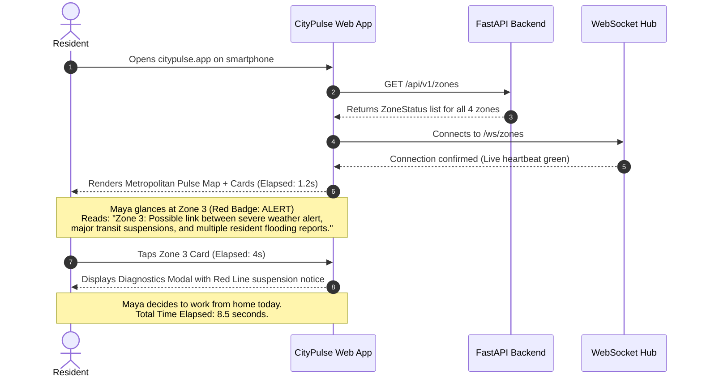
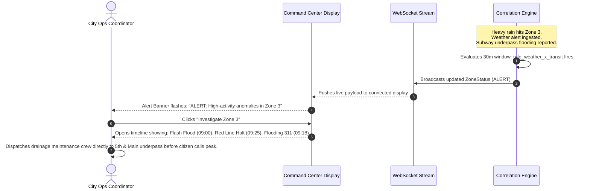

# User Flows
## CityPulse: Citizen 10-Second Glance, Municipal Drill-Down, and Alert Investigation

---

## 1. User Flow 1: Resident 10-Second Morning Glance

**Actor:** Maya (Resident of Zone 3)  
**Goal:** Determine if her morning commute is disrupted before leaving her apartment.

---

## 2. User Flow 2: Municipal Operator Pattern Detection

**Actor:** Marcus (City Operations Staff)  
**Goal:** Identify multi-department incidents before 311 escalation queues overflow.

---

## 3. User Flow 3: Graceful Feed Degradation Flow

**Actor:** Public Viewer  
**Scenario:** Upstream GTFS-RT Transit server goes offline.

1. **Detection:** Transit adapter encounters 3 consecutive HTTP 504 Gateway Timeouts.
2. **Health Update:** Ingestion manager flips `feed_health.transit.status = "delayed"`.
3. **Engine Evaluation:** Correlation engine ignores the stale transit stream, continuing evaluation on weather and 311 complaints.
4. **User Feedback:**
   - The dashboard remains fully operational.
   - The Feed Health widget shows an amber badge: `"Transit Alerts: Delayed"`.
   - The user is notified honestly without false alarms or crashes.
