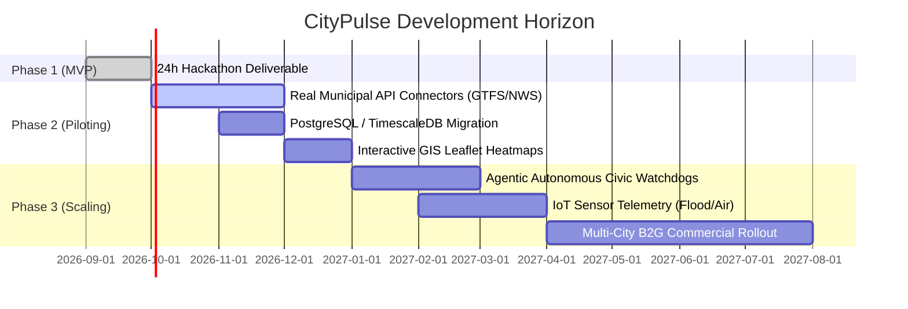

# Future Scope & Product Roadmap
## CityPulse: Post-Hackathon Evolution & Commercialization Strategy

---

## 1. Post-Hackathon Roadmap

---

## 2. Advanced Feature Roadmap

### 2.1 Agentic Autonomous Civic Watchdogs
- Deploy autonomous AI agents that monitor civic telemetry 24/7.
- Instead of passively waiting for user queries or page visits, the agent drafts municipal debriefs and proactively suggests cross-agency dispatch actions (e.g., notifying the Department of Transportation when water sensors reach critical levels).

### 2.2 Direct IoT Sensor Integration
- Connect directly to physical smart-city IoT hardware:
  - Ultrasonic storm drain level sensors.
  - Optical traffic density cameras.
  - Hyper-local particulate matter ($PM_{2.5}$) air quality nodes.

### 2.3 Historical Time-Scrubber & Predictive Modeling
- Enable municipal planners to replay past urban crises (hurricanes, marathons, power grid failures) to optimize response times.
- Train predictive spatio-temporal graph neural networks (ST-GNN) to forecast cascade delays 30–60 minutes in advance.

### 2.4 Mobile Push & Progressive Web App (PWA)
- Offline-capable PWA with geofenced neighborhood notifications.
- Users receive gentle alerts only when their specific home or work zone transitions to `Alert` status.

---

## 3. Commercialization & B2G Business Model
- **Core SaaS Tier:** Sold to municipal governments, transit authorities, and regional emergency management agencies.
- **Data Licensing Tier:** Aggregated, anonymized urban resilience data licensed to risk insurers, commercial real estate developers, and logistics fleet operators.
- **Public Guarantee:** The resident-facing dashboard remains 100% free and open, establishing municipal trust and widespread civic adoption.
